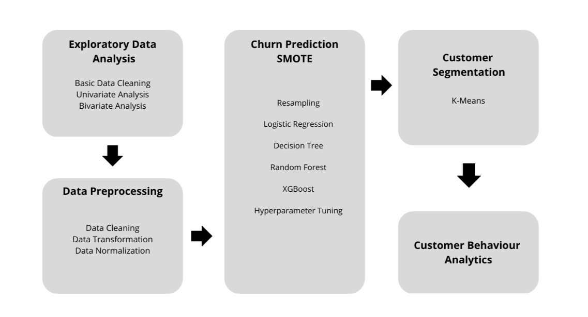
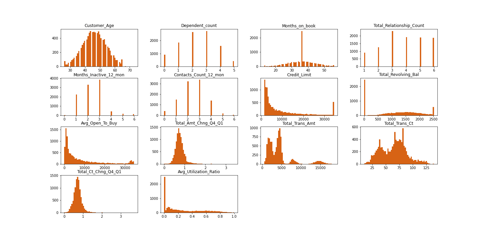
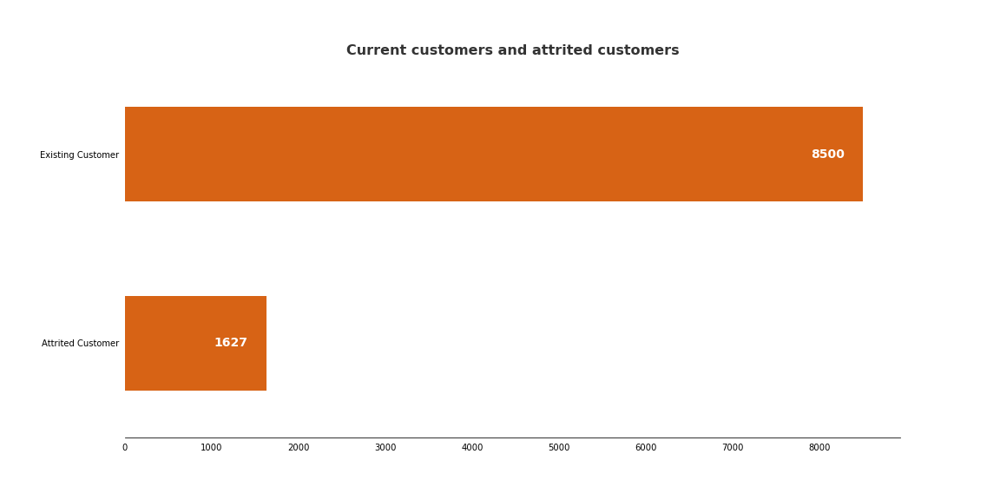
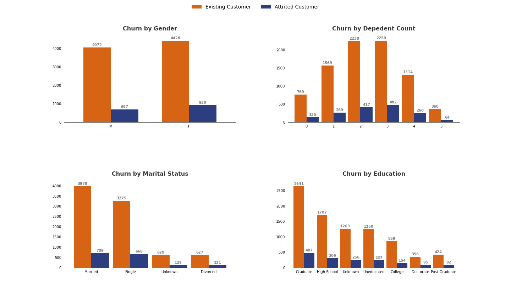
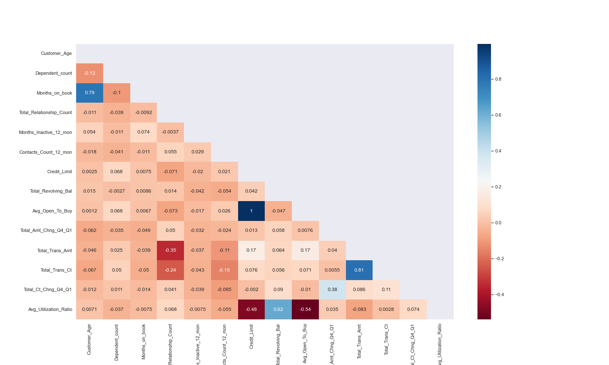
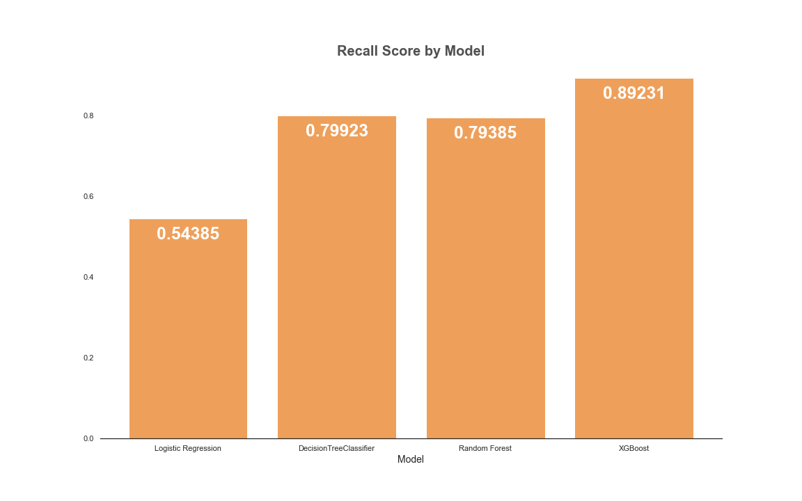
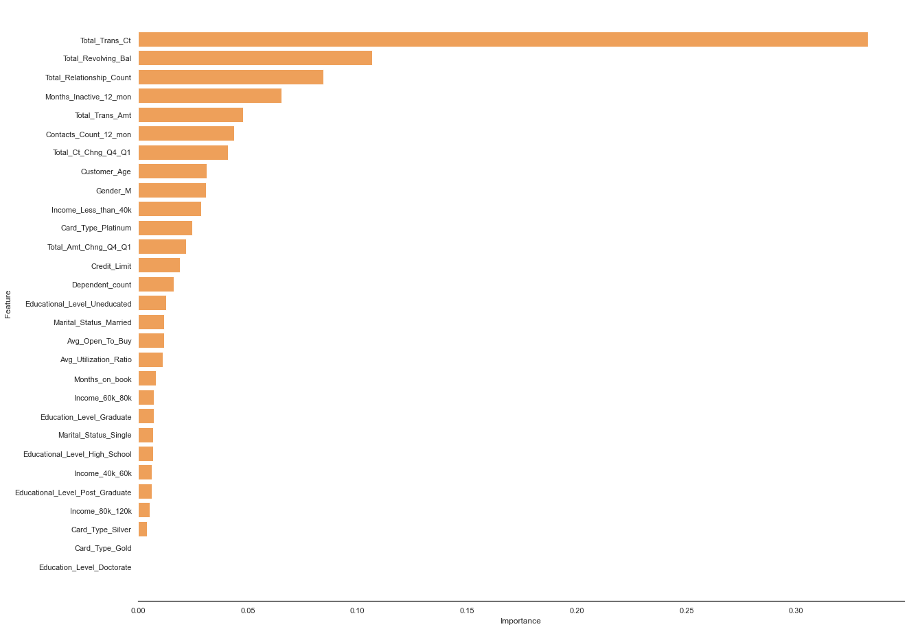
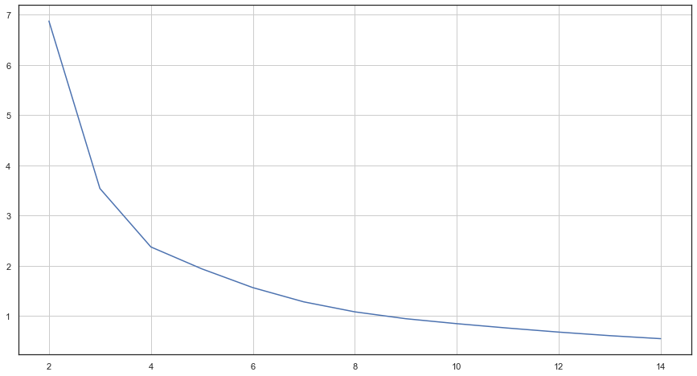
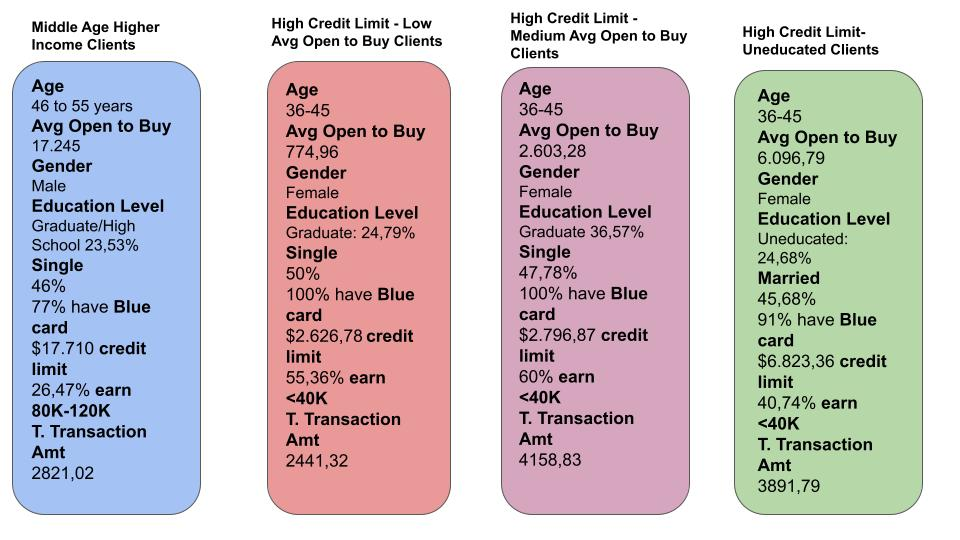

- [Dataset](https://www.kaggle.com/datasets/sakshigoyal7/credit-card-customers)
- [Data Dictionary](https://github.com/biancaportela/customer_churn_segmentation/blob/main/data/data_dictionary.md)

- [Final project](https://github.com/biancaportela/customer_churn_segmentation/blob/main/analysis.ipynb)

# Customer Churn Prediction and Segmentation for Credit Card Services

In this exercise, I am addressing a churn problem for a hypothetical bank that provides credit card services. My goal is to predict which customers are at risk of churning and understand their behavior. This will allow the bank to proactively engage with these customers and offer better services to retain them, ultimately improving customer retention rates.

Churn can be costly for the bank, as acquiring new credit card customers is more expensive than retaining existing ones. It is a critical metric that can significantly impact the bank's profitability. By accurately predicting churn, the bank can take proactive measures to prevent customer attrition, enhance customer satisfaction, and improve overall business performance.

Through effective customer segmentation, bank operators can provide personalized services and carry out precision marketing based on customer needs and consumption characteristics in different customer segments. 

So in this project, I first predict the churn status of the customers using multiple learning classifiers such as Logistic Regression, Decision Tree, Random Forest, and XGBoost. Recall is the main metric used to measure the models for imbalanced datasets, as accurately predicting positive instances is critical for decision-making. After implementing churn prediction, I proceed with churn customer segmentation using K-means clustering. Customers are segmented into different groups, allowing marketers and decision-makers to adopt retention strategies more precisely.

Additionally, I conduct a more detailed analysis of the characteristics of each cluster. Among all the customers who are about to churn, bank operators should not take the same measures for every single customer. That's because not all customers are of high value. In that sense, bank operators should allocate more resources to retain high-value customers.
The picture below shows the analytics framework for this project:

## Exploratory Data Analysis

I began the analysis by performing basic data cleaning tasks such as dropping useless columns, checking for typos, missing values, and removing duplicates. After this initial step, I proceeded with exploratory analysis.

Upon examining the numerical data, the following insights were observed:

|                        |   count |        mean |         std |    min |      25% |      50% |       75% |       max |
|------------------------|--------:|------------:|------------:|-------:|---------:|---------:|----------:|----------:|
| Customer_Age           | 10127.0 |   46.325960 |    8.016814 |   26.0 |   41.000 |   46.000 |    52.000 |    73.000 |
| Dependent_count        | 10127.0 |    2.346203 |    1.298908 |    0.0 |    1.000 |    2.000 |     3.000 |     5.000 |
| Months_on_book         | 10127.0 |   35.928409 |    7.986416 |   13.0 |   31.000 |   36.000 |    40.000 |    56.000 |
| Credit_Limit           | 10127.0 | 8631.953698 | 9088.776650 | 1438.3 | 2555.000 | 4549.000 | 11067.500 | 34516.000 |
| Months_Inactive_12_mon | 10127.0 |    2.341167 |    1.010622 |    0.0 |    2.000 |    2.000 |     3.000 |     6.000 |

- **Age**: The average age of customers is 46 years, with a range from 26 years to 73 years.  The top of the dustribution is middle age, ranging around 50 years.
- **Dependents:** On average, each client has 2 dependents, which could provide insight into the household size and potential financial responsibilities of the customers. 
-  **Months on book** Customers have been with the bank for an average of 35 months, which is equivalent to almost 3 years. The minimum duration is 13 months, indicating a relatively stable customer base. Understanding the tenure of customers can help identify long-term customers who may be at higher risk of churn due to changes in their financial situation or other factors.
- **Credit limit**: The average credit limit for customers is $8631. 
- **Months innactive on the last year:** On average, customers have been inactive for 2 months in the last year. 

Regarding the categorical data, we have:
|                 | count | unique |               top | freq |
|-----------------|------:|-------:|------------------:|-----:|
| Attrition_Flag  | 10127 |      2 | Existing Customer | 8500 |
| Gender          | 10127 |      2 |                 F | 5358 |
| Education_Level | 10127 |      7 |          Graduate | 3128 |
| Marital_Status  | 10127 |      4 |           Married | 4687 |
| Income_Category | 10127 | 6      | Less than $40K    | 3561 |
| Card_Category   | 10127 | 4      | Blue              | 9436 |

The majority of the customer base is composed of women who have a higher education, are married, and earn less than $40,000 per year.

I also plotted some graphs, to understand better the data distribution, as well as did the univariate analysis and bivariate analysis:

Here we can see that we have a skewed dataset. When we see the Attrition_Flag closer we can see that the dataset is imbalanced:

Here are some plots that illustrate the characteristics of churned clients. If you're interested in a more detailed view of the data distribution, you can find more comprehensive plots in the notebook.

At last, I plotted a correlation graph. Some notable correlations in this dataset are:
- Months on the book has a high correlation with customer age (0.79)
- Total relationship count has an inverse correlation with total transition amount and total transition count (-0.35 and -0.25, respectively)
- Average Open to Buy has a perfect correlation with Credit Limit.
- Credit Limit has an inverse correlation with Average Utilization Ratio (-0.48)
- Average Utilization Ratio has a positive correlation with Total Revolving Bal (0.62) but has an inverse correlation with Average Open to Buy (-0.54)

## Data Preparation

During the data preprocessing step, I implemented the following procedures to prepare the data for analysis and subsequent machine learning processes:

- **I divided the data into two categories: clients who churned (target variable) and those who did not.**
- **Handled the missing data**: Although my basic data cleaning analysis didn't reveal any missing data, I found potentially hidden missing values labeled as 'Unknown' when analyzing the distributions of individual columns. To handle missing data, we can either drop it, develop a machine learning model to deal with it, or impute it with the mode for categorical data (our case). Dropping the data is not advisable due to information loss in this already small dataset, and developing a machine learning model just to deal with it is outside the project's scope. Therefore, I will impute missing data with the variable mode.

- **Categorical encoding:** In this dataset, we have a series of categorical data. However, some machine learning algorithms do not perform well with categorical data, which is why it is necessary to convert them into numeric data. I chose to use One Hot Encoding as the only method to transform the variables (instead of applying Label Encoding to some other variables) because I intend to work with clustering algorithms later on, and they tend to perform better with this type of encoding. Additionally, I dropped the first dummy variable to avoid multicollinearity in the data, which can impact the performance of the machine learning model.
- **Split the dataset into train and test**

- **Scaled the data:** I employed the MinMaxScaler as the normalization technique in my data preprocessing pipeline. This step is crucial for optimizing the algorithm's runtime and mitigating issues such as overshooting.

## Churn Prediction

I utilized multiple machine-learning classifiers to predict the churn status of customers. The selected classifiers were Logistic Regression (used as a baseline), Decision Tree, Random Forest, and XGBoost. As the dataset was imbalanced, I applied the Synthetic Minority Over-sampling Technique (SMOTE) to the training set to address this issue and improve the performance of the classifiers.

To assess the performance of the models, I employed cross-validation with 5 folds. This involved dividing the original data into different folds for training and testing purposes. The training set was used for model training, while the test set was used for evaluating the performance of the models.

In order to evaluate the performance of the classifiers, I measured accuracy, precision, recall, and F1-scores. 

| Cross-validation  | LogisticRegression | DecisionTreeClassifier | RandomForestClassifier |      XGBClassifier |
|-------------------|-------------------:|-----------------------:|-----------------------:|-------------------:|
| **Overall accuracy**  | 0.9056905126388983 |     0.9343297461557795 |     0.9572896626834526 | 0.9724730200074638 |
| **Overall precision** | 0.8054725417249176 |     0.7938871664698689 |     0.9297991851340053 | 0.9337383914542803 |
| **Overall recall**    | 0.5438461538461539 |     0.7992307692307692 |     0.7938461538461539 | 0.8923076923076924 |
| **Overall F1-score**  | 0.6488419576462471 |      0.796395143029357 |     0.8563305821159378 | 0.9123645304006974 |

However, I considered recall as the main metric for assessing the models. Recall is a vital metric as it represents the proportion of positive examples that are predicted correctly. It is particularly important in imbalanced datasets where accurately predicting positive instances (such as churned customers) is critical for decision-making and business impact.

After comparing the performance of multiple machine-learning classifiers, I selected XGBoost as the best model based on its higher recall score. However, I wanted to further improve its performance, so I used grid search to tune its hyperparameters. After several iterations, I found the optimal combination of hyperparameters that resulted in the best recall score. Specifically, I adjusted the learning rate, maximum depth, and number of estimators. The final hyperparameter values were determined to be a learning rate of 0.3, maximum depth of 6, and 100 estimators. These parameters were selected after careful consideration and validation to ensure they resulted in the best possible performance of the model.

Having my parameters chosen, the next logical step is to train the model. Besides training the model I used feature importance to identify the parameters that had the most significant impact on the model's prediction. This analysis helped me understand which factors played a crucial role in predicting customer churn.

Lastly, I predicted the model and evaluated it on the test set.

| **Final Results** |                    |
|-------------------|-------------------:|
| **Accuracy:**     | 0.9624876604146101 |
| **Precision:**    | 0.8768768768768769 |
| **Recall:**       | 0.8929663608562691 |
| **F1:**           | 0.8848484848484849 |
| **AUC:**          | 0.9344172592980581 |

## Customer Segmentation and Customer Behaviour Analytics

In order to perform churn management, I conducted customer segmentation on the churn data. K-Means was used to cluster the customers, and the elbow technique was applied to decide the appropriate number of clusters to use. It's worth noting that the customer segmentation was only conducted on the churn data as it aligns with the project's objectives.

The elbow technique used above incated that a good cluster number to use is 4.

After the customer segmentation, I analyzed customer behavior based on the results of churn prediction and segmentation. This analysis provides valuable insights into customer behavior and can be used to optimize the customer retention strategy.

Firstly, I performed data cleaning, followed by transforming each column into the percentage in each cluster, as well as the value in the entire dataset. I utilized a spreadsheet program to conduct customer behavior analysis, and the results have been summarized in the chart below.

# References

[Credit Card customers data](https://www.kaggle.com/datasets/sakshigoyal7/credit-card-customers), Kaggle

[Integrated Churn Prediction and Customer Segmentation Framework for Telco Business](https://ieeexplore.ieee.org/document/9406002), Wu, Shuli, et al (2021).

[Classes desbalanceadas: você está fazendo errado!](https://www.youtube.com/watch?v=PwlKbdsVsiY&t=1s), Let's Data

[ Como usar Clusters para encontrar padrões nos seus dados | ML do Básico ao Aplicado ](https://www.youtube.com/watch?v=GBSTT5NBE4g), Rafinha dos Dados

